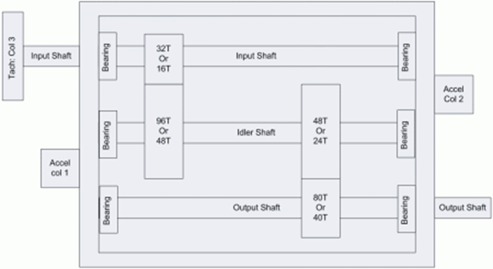
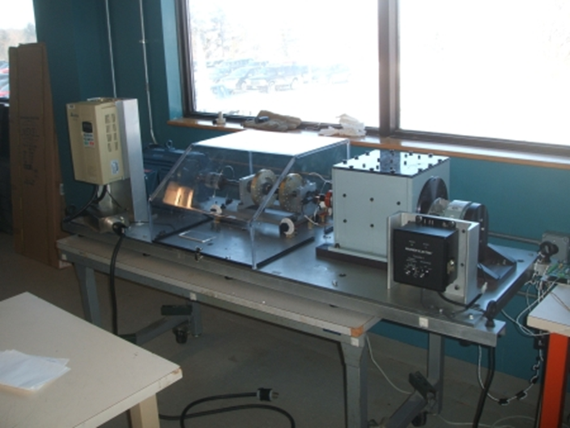
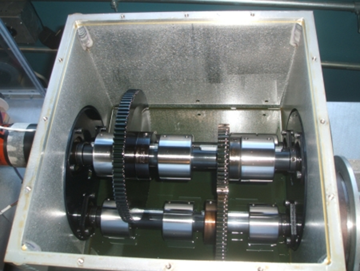
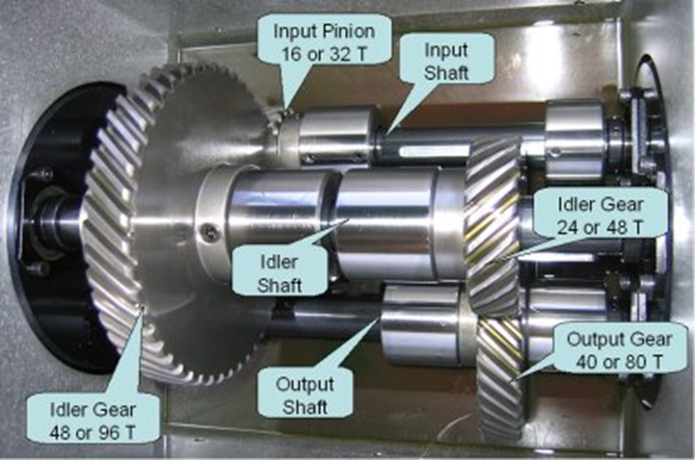
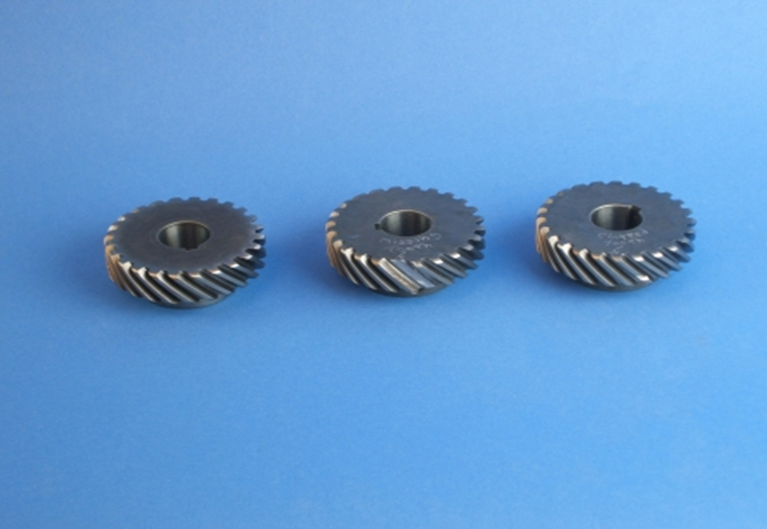
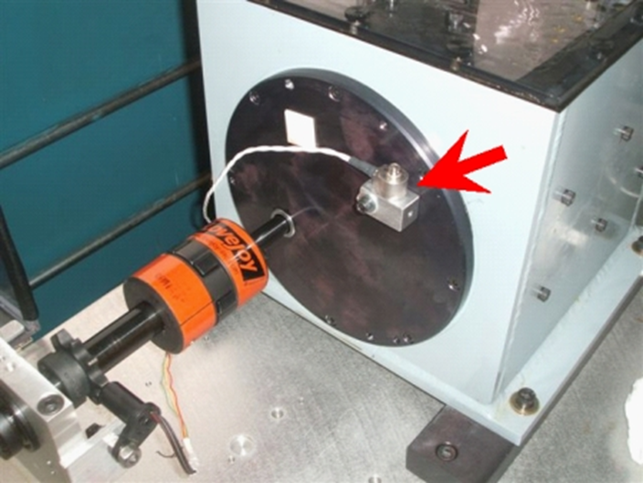
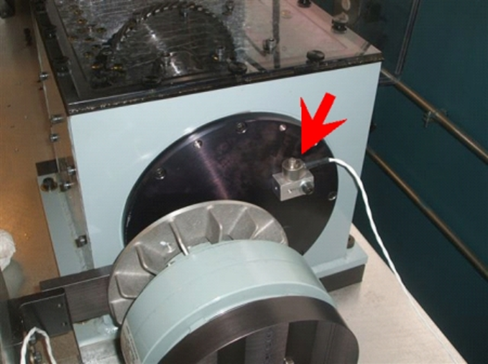
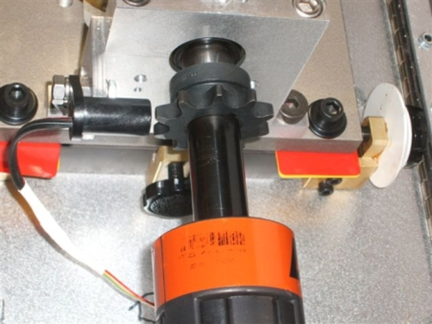
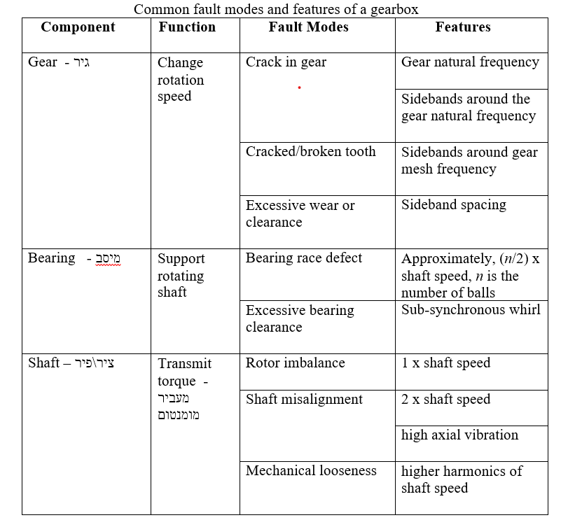

## PHM Data Challenge 
This PHM Data Challenge is focused on fault detection and magnitude estimation for a generic gearbox using accelerometer data and information about bearing geometry. Scoring is based on the ability to correctly identify type, location, and magnitude and damage in a gear system.
Additional information can be found on the competition blog, http://phm09challenge.blogspot.com.

Gearbox
The data presented here are representative of generic industrial gearbox data. Figure 1 is a schematic of the gearbox used to collect the data.
 
Figure 1: Schematic of the apparatus (click to enlarge).
Two geometries are used,one using a spur gears, the other using spiral cut (helical) gears. The spur geometry is:
	Input shaft: 1-Input Pinion: 32 teeth
	Idler shaft: 1st idler gear: 96 teeth
	Idler shaft: 2nd (output) idler gear: 48 teeth
	Output shaft: output pinion: 80 teeth
Thus, from input to output the gear reduction ratio is: 16/48*24/40, or 5 to 1 reduction.
Acquisition System
Endevco 10mv/g Accel, +/- 1% error, Resonance > 45KHz.
Three Channels:
	Channel 1 is the input side Accelerometer
	Channel 2 is the output side Accelerometer
	Channel 3 is the Tachometer Signal: 10 pulse per revolution
Sample Rate: 66,666.67 Samples per Second (200 KHz/3).
Bearing
MB Manufacturing ER-10K
Number of Elements: 8
Roller Element Diameter: 0.3125"
Pitch Diameter: 1.319"
Contact Angle: 0
 
Figure 2: Overview of the apparatus (click to enlarge).
 
Figure 3: Inside the gearbox (click to enlarge).
 
Figure 3a: Inside the gearbox detail (click to enlarge).
 
Figure 4: Example of gear faults. Left to right: normal, missing tooth, chipped tooth (click to enlarge).
 
Figure 5: Location of input shaft accelerometer.
 
Figure 6: Location of output shaft accelerometer.
 
Figure 7: Detail of tachometer pickup.

## Fundamentals
Some fundamental signal processing techniques and diagnostic features for gearbox components are provided below. The information provided is only intended as a brief introduction to existing domain knowledge and is NOT meant to guide the challenge participants in any way.
Time Synchronous Averaging

Accelerometer Data Analysis
Accelerometer data can be analyzed in a variety of domains like time, frequency, wavelet, etc. The most common ones are time and frequency. Some popular time domain techniques are decimating, digital filtering, averaging, and RMS. Frequency domain analysis typically comprises Fourier transform, windowing, and spectral analysis of power and amplitude. More information about processing accelerometer data can be found here.

Gearbox Component Fault Signatures

## Data
Data were sampled synchronously from accelerometers mounted on both the input and output shaft retaining plates. An attached tachometer generates 10 pulses per revolution providing very accurate zero crossing information.
Data were collected at 30, 35, 40, 45 and 50 Hz shaft speed, under high and low loading. Additionally, different repeated runs are included in the data, although the run time and load were not sufficient to induce significant fault progression. There are a total of 560 samples to be classified.
Data are provided in .csv files, with three columns - the first column is input voltage, second is output voltage, and the third is tachometer.

# Submitting Results
Results must be submitted as a (CSV) file, with exactly 560 rows and 1 column. The values must be 1 or 0, with 1 corresponding to "true" and 0 corresponding to "false".
Each row corresponds to run number, i.e., row 1 should correspond to the data in Run_1.csv

# Performance Evaluation
The goal is to minimize the Hamming distance between your results matrix and the true state of the system. For example, if the true state of the system is [1,0,0,1,0] and you submit [1,1,0,0,0,0], your score is 2. Best possible performance is indicated by a Hamming distance score of 0 and the worst score is (560x1=)560, provided the uploaded file is correctly formatted. Only the Hamming distance score mentioned above is used to determine the final scores and ranking.

